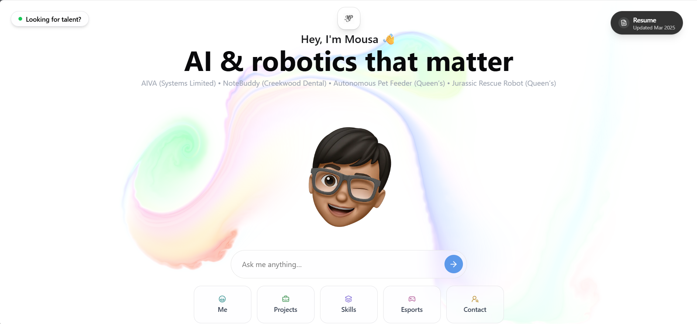

# Mousa Pirzada — AI & Robotics Engineer 🚀  

Hi, I’m **Mousa Pirzada**, a Mechatronics & Robotics Engineering student at Queen’s University, passionate about **AI, robotics, and building things that actually matter**.  

This repo contains the source code for my **AI-powered portfolio** — a new way to tell my story.  
Instead of scrolling through static pages, you can **chat directly with my portfolio** to learn about my work, skills, and projects.  

---

## 👋 About Me

- 🎓 **4th Year Mechatronics & Robotics Engineering student** (Queen’s University, Canada)  
- 🤖 Passion for **AI + Robotics**: I love building tools that bridge hardware, software, and intelligence.  
- 🛠️ Project builder: From **AIVA (AI Voice Assistant at Systems Limited)** to **NoteBuddy/DentalBuddy**, an AI notetaking tool for dentists.  
- 📚 **Private Tutor (2+ years):** Teaching calculus, linear algebra, statistics, and computer science to university students.  
- 🌍 Entrepreneurial mindset: I’ve launched products, built startups, and worked with real clients (e.g. Creekwood Dental).  

---

## 🔥 Featured Projects

- **AIVA (AI Voice Assistant)** — built during my internship at Systems Limited, presented to department leadership.  
- **DentalBuddy / NoteBuddy** — AI notetaking assistant used in real dental clinics.  
- **Autonomous Pet Feeder** — IoT feeder with iOS app + Siri integration.  
- **Jurassic Rescue Robot** — robotics design project for a Jurassic-themed challenge.  

---

## 💡 Why This Portfolio?

I wanted a portfolio that reflects *how I actually think*.  
So instead of a static website, you get a **conversation**:  

- Recruiter? → Ask about my stack, results, and skills.  
- Engineer? → Ask for design choices, code, or technical breakdowns.  
- Curious friend? → Ask what I’m building right now.  

This is the **world’s first AI portfolio** — it adapts to your curiosity.  

---

## 🚀 Run It Locally

Want to explore or fork it?  

### Prerequisites
- Node.js (v18+)
- pnpm package manager
- OpenAI API key
- GitHub token

### Setup
```bash
git clone <your-repo-url>
cd portfolio
pnpm install
```

Create a `.env` file:
```env
OPENAI_API_KEY=your_openai_api_key_here
GITHUB_TOKEN=your_github_token_here
```

Start dev server:
```bash
pnpm dev
```

Open 👉 `http://localhost:3000`

---

## 📬 Get in Touch

- 📧 **Email:** mousapir@gmail.com  
- 🔗 [LinkedIn](https://www.linkedin.com/in/mousa-pirzada/)  
- 💻 [GitHub](https://github.com/20mup)  
- 🎥 [YouTube](https://www.youtube.com/@mousapirzada4604)  

---

### 🔖 Tags
`#AIPortfolio` `#Robotics` `#AI` `#Engineering` `#Innovation` `#WebDevelopment` `#FutureTech`
